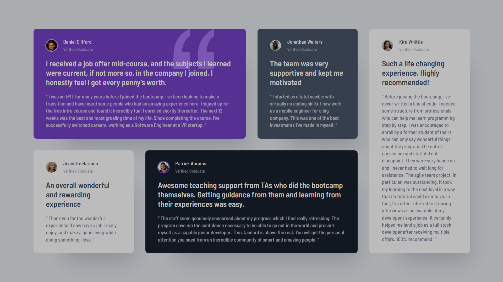
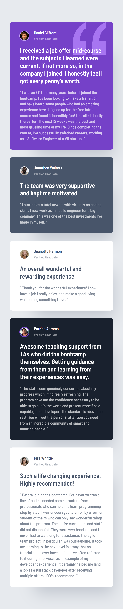

# Table of contents

- [Overview](#overview)
  - [The challenge](#the-challenge)
  - [Screenshot](#screenshot)
  - [Links](#links)
- [My process](#my-process)
  - [Built with](#built-with)
- [Author](#author)

## Overview

### The challenge

Users should be able to:

- View the optimal layout for the site depending on their device's screen size

### Screenshot

### Links

- Solution URL: (https://github.com/Vinnykells/testimonials)
- Live Site URL: (https://testimonials-woad-nine.vercel.app)

## My process

### Built with

- Semantic HTML5 markup
- CSS custom properties
- Flexbox
- CSS Grid
- Mobile-first workflow

## Author

- Website - 
- Frontend Mentor - [@vinnykells](https://www.frontendmentor.io/profile/vinnykells)
- Twitter - [@vinnykellsx](https://www.twitter.com/vinnykellsx)
